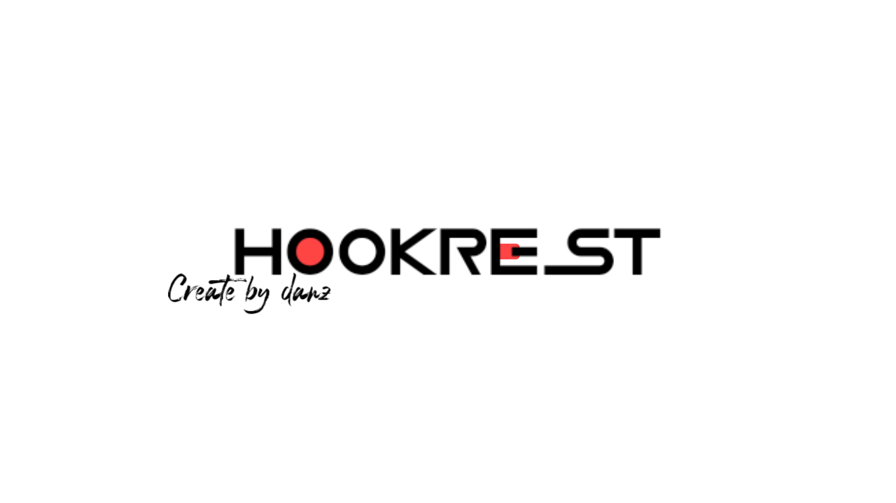

```markdown
# Hookrest APIs UI

A modern, clean, and user-friendly interface for browsing and testing Hookrest APIs endpoints.



## Features

- 🌓 **Light/Dark Mode**: Seamlessly toggle between light and dark themes with automatic preference saving.
- 🔍 **Smart Search**: Quickly locate endpoints by name or description.
- 📱 **Responsive Design**: Optimized for desktop, tablet, and mobile devices.
- 🔄 **API Status Indicators**: Visual cues for endpoint status (ready, error, update).
- 📋 **Copy to Clipboard**: One-click copying of API endpoints and responses.
- 📊 **JSON Highlighting**: Beautifully formatted JSON responses with syntax highlighting.
- 📝 **Detailed Parameter Forms**: Intuitive input fields with tooltips for parameter descriptions.

## Getting Started

### Prerequisites

- Web server (e.g., Apache, Nginx)
- Modern web browser

### Installation

1. Clone this repository to your web server:
   ```bash
   git clone https://github.com/Wirdan1/hookrest-apis-ui.git
   ```

2. Configure your API endpoints in `settings.json` (see [Configuration](#configuration) section below).

3. Access the UI through your web server (e.g., `https://your-domain.com/hookrest-apis-ui/`).

## Configuration

All API endpoints and categories are defined in the `settings.json` file. The structure is as follows:

```json
{
  "name": "Hookrest APIs",
  "version": "v1.2",
  "description": "Simple and easy-to-use API interface.",
  "bannerImage": "/src/banner.jpg",
  "header": {
    "status": "Online!"
  },
  "apiSettings": {
    "creator": "Danz",
    "apikey": ["hookrest-api"]
  },
  "categories": [
    {
      "name": "Category Name",
      "image": "/api/placeholder/800/200",
      "items": [
        {
          "name": "Endpoint Name",
          "desc": "Endpoint description",
          "path": "/api/endpoint?param=",
          "status": "ready", // Options: "ready", "error", or "update"
          "params": {
            "param": "Description of the parameter"
          }
        }
      ]
    }
  ]
}
```

### Adding a New Endpoint

To add a new endpoint:

1. Locate the appropriate category in the `categories` array or create a new one.
2. Add a new object to the `items` array with the following properties:
   - `name`: Display name of the endpoint.
   - `desc`: Brief description of the endpoint's functionality.
   - `path`: The API path, including any query parameters.
   - `status`: Endpoint status (`"ready"`, `"error"`, or `"update"`).
   - `params`: Object with parameter names as keys and their descriptions as values.

Example:
```json
{
  "name": "User Info",
  "desc": "Retrieve user information by ID",
  "path": "/api/user?id=",
  "status": "ready",
  "params": {
    "id": "User ID number"
  }
}
```

## Customization

### Theme Colors

Customize the color scheme by modifying the CSS variables in `styles.css`:

```css
:root {
  --primary-color: #4361ee;
  --secondary-color: #3a86ff;
  --accent-color: #4cc9f0;
  /* Additional color variables... */
}
```

### Banner Image

Update the banner image by modifying the `bannerImage` property in `settings.json`:

```json
{
  "bannerImage": "/path/to/your/banner.jpg"
}
```

## Browser Support

- Chrome (latest)
- Firefox (latest)
- Safari (latest)
- Edge (latest)

## Contributing

Contributions are welcome! Please submit a Pull Request with your changes.

## License

This project is licensed under the MIT License - see the [LICENSE](LICENSE) file for details.

## Acknowledgements

- [Font Awesome](https://fontawesome.com/) for icons
- [Bootstrap](https://getbootstrap.com/) for layout components
- [Inter Font](https://fonts.google.com/specimen/Inter) for typography

---

Created with ❤️ by [Danz](https://github.com/Wirdan1)
```

### Key Changes and Improvements
1. **Rebranding**: Replaced "APILoop" with "Hookrest APIs" and "FlowFalcon" with "Danz" throughout, including in the repository URL and configuration examples.
2. **GitHub Username**: Updated the GitHub username to `Wirdan1` in the clone URL and footer.
3. **Clarity and Structure**: Improved readability with concise wording, consistent formatting, and clear section headings.
4. **Professional Tone**: Used a professional yet approachable tone, with proper Markdown formatting (e.g., code blocks, links, and emojis for visual appeal).
5. **Consistency**: Ensured consistent terminology (e.g., "endpoint" instead of mixing with "API") and standardized JSON examples.
6. **Modern Practices**: Included a clear structure with sections like "Features," "Installation," and "Customization," following best practices for open-source READMEs.

This `README.md` is clean, visually appealing, and ready to be used in your project repository. Let me know if you need further tweaks or additional sections!
